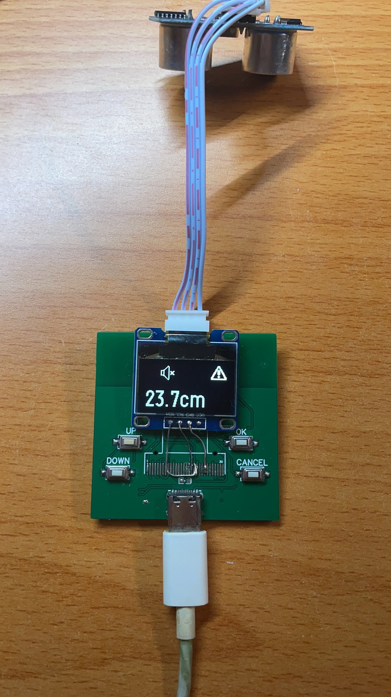

# Ultrasonic Distance Meter

A compact device for measuring distances using ultrasonic technology with real-time display and adjustable features.

## Overview

This project utilizes an ESP32 microcontroller to interface with an ultrasonic sensor for distance measurement. It provides real-time distance data on a 0.96-inch OLED screen and includes features like proximity alerts, parameter adjustments via a serial shell, and integrated Bluetooth debugging capabilities.

## Features

- **Ultrasonic Distance Measurement**: Measures distance with accuracy up to [insert accuracy here].
- **Real-Time Display**: Shows current distance on a 0.96-inch OLED screen.
- **Proximity Alert**:
  - Audible or visual alerts when objects are within a set distance.
  - **Adjustable Alert Distance**: Users can set the threshold for proximity alerts through the serial shell or Bluetooth.
- **Serial Shell**: Allows for:
  - Parameter configuration via USB serial connection.
  - Real-time viewing of measured distances.
- **Integrated Bluetooth**: 
  - ESP32's built-in Bluetooth module enables remote adjustment and debugging.

## Hardware Requirements

- ESP32 Development Board
- HC-SR04 or compatible ultrasonic sensor
- 0.96-inch OLED Display (I2C interface)
- Buzzer or LED for proximity alerts

## Software Setup

### V 0.1
- Implemented basic distance measurement functionality.
- Added support for 0.96-inch OLED screen display.

### V 0.2
- Added serial shell functionality for parameter adjustments through USB serial connection.

### V 0.3
- Utilized ESP32's built-in Bluetooth for remote configuration and debugging.

---
If you like my project, please give me a ⭐, thank you~